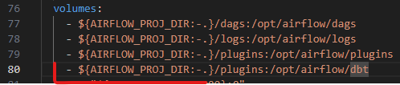

# dbt with Airflow - materials
Materials about running dbt with Airflow:
- [www.astronomer.io](https://www.astronomer.io/docs/learn/airflow-dbt/) - Creating a task group.
- [astronomer.github.io](https://astronomer.github.io/astronomer-cosmos/getting_started/open-source.html) - Creating a dbt dag.
- [astronomer.github.io](https://astronomer.github.io/astronomer-cosmos/configuration/execution-config.html) - Configuration (for example creating execution_config)
- [astronomer.github.io](https://astronomer.github.io/astronomer-cosmos/profiles/index.html) - Creating profiles (creating profile_config)

# Docker compose
We are using here the original Docker compose file for Airflow (which we can get from here: [airflow.apache.org](https://airflow.apache.org/docs/apache-airflow/stable/howto/docker-compose/index.html)) which we have modified slightly.

We added this line nr 80 to the original file: \

In order to mount the dbt folder to the Docker container.

# dbt project configuration
We need to add the profiles.yml file to the dbt/data_warehouse folder where we specify the database in which we will be performing data transformations.

In that file we need to provide the password which will be used for connecting to the created MS SQL server. We set up that password in the Dockerfile what is described in the next section of this documentation 'MS SQL setup'.

# MS SQL setup
Before running the Airflow DAG we need to create a MS SQL database where dbt will be performing data transformations. It will be created using the 'mssql' service in the docker-compose.yml and dockerfiles/mssql/Dockerfile.mssql file.

We need to create the Dockerfile.mssql file which looks like the Dockerfile-draft.mssql file, which is a draft of the Dockerfile we need to prepare. We need to provide there a password which will be used for logging into the created MS SQL server. We assign that password to the SA_PASSWORD environment variable in the Dockerfile.

# virtual environment
In the Docker file we are creating a virtual environment where we are installing dbt. We are creating that virtual environment in order to make sure the dbt libraries will not be in conflict with Airflow libraries.

In the Airflow DAG we are specifying as the executable path the path from that virtual environment. That means that Airflow in order to run dbt commands (like dbt run) will use dbt executables from that virtual environment. 

# powershell scripts
In the powershell_scripts folder there are powershell scripts which can be used for working with docker:
- docker_compose_up.ps1 - build and run container and save logs in the dockerfiles/docker_logs folder (that script needs to be ran from the repository root)
- docker_clean.ps1 - delete all the containers and images
- sql_connect.ps1 -password <your_password> - connect to the create MS SQL server
